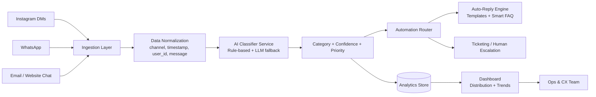

# Beastlife AI Customer Care Automation Workflow

## 1) End-to-End Architecture

## 2) Workflow Steps

1. **Capture customer messages** from Instagram, WhatsApp, email, and web chat.
2. **Normalize data** into one schema with source metadata.
3. **Classify issue type** using a hybrid model:
   - Deterministic keyword/rule layer for speed and consistency.
   - LLM fallback for ambiguous messages.
4. **Calculate confidence score** and route:
   - High confidence + solvable issue -> automated response.
   - Low confidence / high-risk issues -> human escalation.
5. **Persist all events** for analytics and continuous model improvement.
6. **Generate automation recommendations** based on issue volume and category.
7. **Visualize trends** by issue percentages and time windows (weekly/monthly).

## 3) Category Taxonomy

- `Order status`
- `Delivery delay`
- `Refund request`
- `Product issue`
- `Subscription issue`
- `Payment failure`
- `General product question`
- `Other`

## 4) Automation Playbook by Category

- **Order status**: Auto-fetch order from OMS and send live status with ETA.
- **Delivery delay**: Trigger proactive apology + revised ETA + coupon if SLA breached.
- **Refund request**: Validate policy, gather required info, create refund workflow.
- **Product issue**: Capture batch/SKU/photo info, create QA ticket automatically.
- **Subscription issue**: Offer pause/skip/cancel flows with self-serve links.
- **Payment failure**: Recommend alternate method + retry link + failure reason.
- **General product question**: Answer through retrieval from FAQ/knowledge base.

## 5) Human-in-the-Loop Controls

- Escalate when confidence < threshold (e.g., < 0.60).
- Escalate urgent sentiment (angry/chargeback/legal language).
- Escalate repeat contacts from same user within short window.

## 6) Scale Strategy

- Stateless classifier service behind queue (Kafka/SQS/PubSub).
- Batch analytics jobs every 5-15 min.
- Cache FAQ retrieval embeddings.
- Add active-learning loop: human-corrected labels feed retraining.
